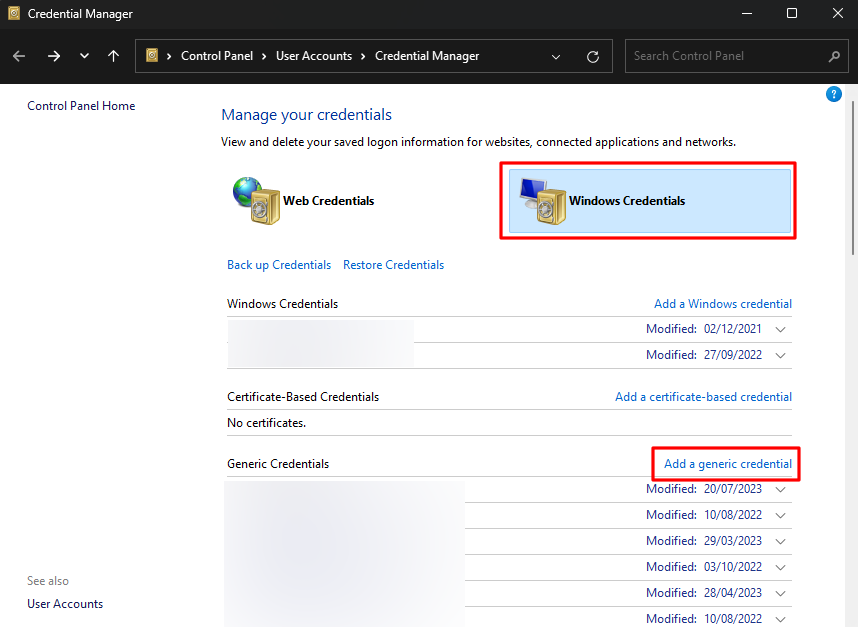
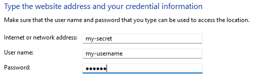
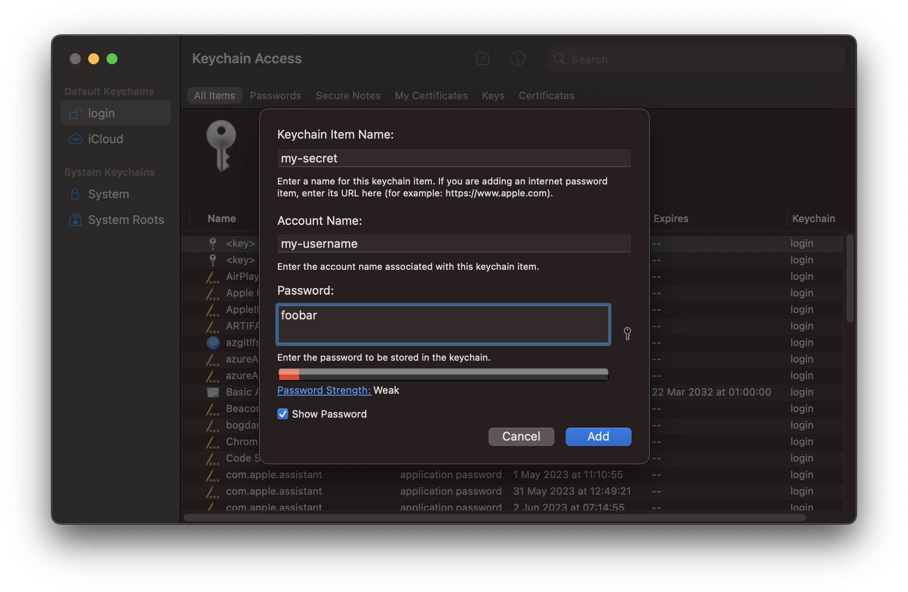
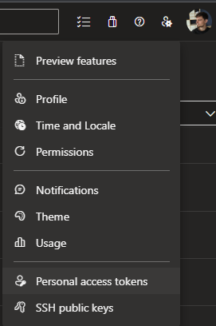
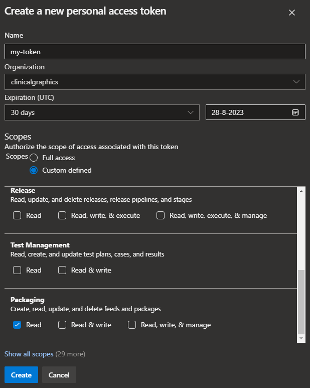

# keycmd

[](https://github.com/clinicalgraphics/keycmd/actions/workflows/ci.yml)
[
](https://badge.fury.io/py/keycmd)

Prefix any command with `keycmd` to safely source your secrets and credentials from the OS keyring, instead of risky `.env` files (or worse 🙈). Common applications include npm, pip, poetry, docker, docker compose and kubectl!

Supports Windows, macOS and Linux.

## About

The main functionality of `keycmd` is to load secrets from your OS keyring and expose them as environment variables for the duration of a single shell command or alternatively for the lifetime of a subshell.

This enables you to store sensitive data such as authentication tokens and passwords in your OS keyring, so you no longer need to rely on insecure practises such as `.env` files, or pasting secrets into your terminal. 😱

The most common use case is to load credentials for package managers such as pip and npm when using private package indexes, such as Azure Artifact Feeds. Another common use case is docker build secrets.

## Installation

> **Note**
> If you're intending to install `keycmd` in a WSL or pyenv environment, you'll have to skip ahead to the specific installation instructions for those environments.

### Global installation

Install `keycmd` from pypi using `pip install keycmd`, or whatever alternative python package manager you prefer.

Note that the executable `keycmd` has to be installed to a folder that is on your `PATH` environment variable, or the command won't be available globally. Assuming you were able to run `pip` just now, the `keycmd` executable should end up in the exact same location and everything should be fine.

To verify keycmd is installed and available, run `keycmd --version`.

### pyenv installation

Now, if you're using pyenv, you're going to have to jump through a few hoops since keycmd needs to be installed globally, which flies directly into the face of what pyenv is trying to accomplish.

This guide assumes you've also installed [pyenv-virtualenv](https://github.com/pyenv/pyenv-virtualenv), in order to get you the cleanest of setups. ✨

> **Note**
> These pyenv instructions are for pyenv on Linux and MacOS. If you are using pyenv-win on Windows, these instructions are most likely not 100% compatible with your setup.

Run the following commands one by one to install keycmd into its own standalone environment:

```bash
# run the following commands one by one
pyenv virtualenv 3.9 keycmd
pyenv activate keycmd
pip install keycmd
pathToKeycmd=$(python -c 'import sys; from pathlib import Path; print(Path(sys.executable).parent / "keycmd")')
pyenv deactivate
mkdir -p $HOME/.local/bin
ln -s $pathToKeycmd $HOME/.local/bin/keycmd
```

Finally, edit your `~/.bashrc` file (or whatever shell profile you use) to include `~/.local/bin` in your `PATH` variable:

```bash
export PATH="$HOME/.local/bin:$PATH"
```

> **Note**
> This line may already be in place in your `~/.bashrc`, for example, if you installed poetry! It's a common trick used to expose specific binaries on `PATH` when they are in folders that also include binaries that should _not_ be exposed on `PATH`.

To verify keycmd is installed and available, run `keycmd --version`.

### WSL installation

If you're using WSL, you'll run into a wall when you first try to use keycmd. That's because keycmd uses the keyring library to connect to OS keyrings, and keyring will attempt to connect to your linux distro's (probably Ubuntu) keyring background service, which by default isn't actually running in a WSL environment!

If you did actually set up your linux distro's keyring background service, that's fine, you can continue using it and don't need to perform any additional steps.

> **Note**
> Just because you installed WSL on your system, does not mean you are actually working in WSL. Think about this for a moment; are you using Python from Windows or from WSL? The instructions here are only necessary if you are actually working in WSL.

So, if you would like keyring to connect from the WSL environment to your Windows Credential Manager instead, continue with the next steps.

You have to install keycmd according to the above instructions (globally, or with pyenv) **in Windows**, not in WSL. Then, assuming `keycmd` is on your Windows `PATH`, it should now be available in WSL as well!

### Up- and downgrading

If at a later point in time, you want to install a different version of keycmd, just use pip again.

> **Note**
> If you're using pyenv, make sure to activate the virtual environment first with `pyenv activate keycmd`. Don't forget to `pyenv deactivate` afterwards.

* To upgrade to latest: `pip install -U keycmd`
* To install a specific version: `pip install keycmd==0.6.0`

## Quickstart

Now that keycmd is installed, we can perform a quick test to see how it works!

Let's add a new key to our OS keyring, and then see how we can expose it with keycmd.

For the purpose of this example, use `my-secret` as the credential name and `my-username` as the... username. I used `foobar` as the password.

On Windows, that means clicking Start and typing "Credential Manager" to find the app. Click the Windows Credentials tab, and click "Add a generic credential". See the screenshots below.





On macOS, open Keychain Access (Command-Space bar, type `keychain access`), then press Command-N to add a 
new password item. Please note that Account Name holds the username.



> **Note**
> Pull requests to add visual guides for linux keyrings are most welcome!

Now, create a `.keycmd` config file in your user home folder. Put the following configuration in the file and save:

```toml
[keys]
SECRET = { credential = "my-secret", username = "my-username" }
```

Finally, open a terminal and run a command to print the secret, so we can see if it worked. That's going to look different depending on what shell you're using, so here's a couple examples:

* Cmd: `keycmd echo %SECRET%`
* Powershell: `keycmd 'echo $env:SECRET'`
* Bash: `keycmd 'echo $SECRET'`

You should see the text `foobar` being printed to the terminal.

You've successfully set up keycmd! 👏

See the [advanced configuration example](#advanced-example) below for a more involved usecase for keycmd, where poetry, npm and docker-compose are all put together.

## Usage

The CLI has the following options:

```
❯ keycmd --help
usage: keycmd [-h] [-v] [--version] [--shell] ...

positional arguments:
  command        command to run

optional arguments:
  -h, --help     show this help message and exit
  -v, --verbose  enable verbose output, useful for configuration debugging
  --version      print version info
  --shell        spawn a subshell instead of running a command
```

There are two main ways to use the CLI:

* `keycmd 'your command'`
* `keycmd --shell`

The first is the most preferred method, since your secrets will only be exposed as environment variables during a one-off command. The latter is less preferable, but can be convenient if you are debugging some process that depends on the credentials you are exposing.

## Configuration

> **Note**
> if you are having trouble configuring keycmd, refer to section [debugging configuration](#debugging-configuration).

### Locations

Configuration can be stored in three places (where `~` is the user home folder and `.` is the current working directory when calling `keycmd`):

- `~/.keycmd`
- all `.keycmd` found while walking file system up from `.`
- first `pyproject.toml` found while walking file system up from `.`

> **Note:**
> The search for `.keycmd` and `pyproject.toml` will stop at the root of a git repository, and before the user home folder, to ensure your configuration can be applied locally to subtrees of your filesystem.

Configuration files are loaded and merged in the listed order.

### Fields

The options schema is defined as follows:

* `keys`: dict
  * `{key_name}`: dict - an environment variable will be created with this name
    * `credential`: str - the name of the credential in your keyring
    * `username`: str - the username associated with the credential in your keyring
    * `b64`: bool, optional - set to `true` to apply base64 encoding
    * `format`: str, optional - apply a format string (applied before base64 encoding)
* `aliases`: dict, optional
  * `{alias_name}`: dict - an environment variable will be created with this name
    * `key`: str - the key that should be aliased
    * `b64`: bool, optional - see `keys.{key_name}.b64`
    * `format`: str, optional - see `keys.{key_name}.format`

### Format strings

The format string allows you to preprocess the credential before it is exposed as an environment variable.

The format string is processed using Python's built-in [`str.format`](https://docs.python.org/3/library/stdtypes.html#str.format) so you have access to all formatting functionality supported by that function.

Three variables are available for use in the format string:

* `credential`
* `username`
* `password`

So for example you can put together a basic auth header with a configuration string like this: ``

```toml
[keys]
MY_TOKEN = { credential = "MY_TOKEN", username = "azure", format = "{username}:{password}", b64 = true }
```

### Aliases

Aliases can be used to expose the same secret in multiple forms.

For example, you may have a single Personal Access Token for Azure DevOps, and wish to use the same token for `pip`, `npm` and the REST API. `pip` wants you to provide the token in plain text, `npm` prefers it to be base64-encoded and the REST API is expecting a basic auth header. Aliases make this easy:

```toml
[keys]
MY_TOKEN = { credential = "azure_secret", username = "azure" }

[aliases]
MY_TOKEN_B64 = { key = "MY_TOKEN", b64 = true }
MY_TOKEN_BASICAUTH = { key = "MY_TOKEN", format = "{username}:{password}", b64 = true }
```

### pyproject.toml example

You can also store your configuration in `pyproject.toml`, by prefixing the keys with `tool.keycmd`. So if we were to convert the previous example it would look like this:

```toml
[tool.keycmd.keys]
MY_TOKEN = { credential = "azure_secret", username = "azure" }

[tool.keycmd.aliases]
MY_TOKEN_B64 = { key = "MY_TOKEN", b64 = true }
MY_TOKEN_BASICAUTH = { key = "MY_TOKEN", format = "{username}:{password}", b64 = true }
```

## OpenAI example

With OpenAI, you're instructed to [use an API key](https://github.com/openai/openai-python#usage) to authenticate with their APIs. When you put that string in a `.env` file, or directly in your code, you risk sharing your API key with the world! 🙅‍♂️

Instead, just put it in your OS keyring, and expose it with keycmd when you run your python scripts or jupyter notebooks.

For example, if you add it to your OS keyring under the name `my-openai-token` and `your-username`, you would use the following `.keycmd` configuration:

```toml
[keys]
OPENAI_API_KEY = { credential = "my-openai-token", username = "your-username" }
```

Now you can run any OpenAI script by just prefixing your commands with `keycmd`. For example:

```bash
keycmd 'python my_openai_script.py'
```

Or a jupyter notebook:

```bash
keycmd 'jupyter notebook'
```

That's all! 🤘 Now you can rest easily, knowing your tokens are safe. 🛌💤

## Advanced example

This is an example configuration for Poetry, npm and docker-compose. It should inspire you to see the possibilities keycmd provides thanks to its configuration system.

In this case, we are authenticating with an Azure DevOps Personal Acces Token to an Azure Artifacts Feed which serves both python and node.js packages.

Let's begin by creating a Packaging (Read) token in Azure DevOps:



Make sure to check the Packaging (Read) permission, it's the only permission we need for this example.



In this case, we won't enter it into the OS keyring manually. We'll [let Poetry handle it](https://python-poetry.org/docs/repositories/#configuring-credentials). Let's review our `pyproject.toml` file:

```toml
[tool.poetry]
name = "my-project"
version = "1.0.0"
description = ""
authors = ["My Name <my-name@my-organization.com>"]

[[tool.poetry.source]]
name = "main"
url = "https://pkgs.dev.azure.com/my-organization/_packaging/main/pypi/simple/"
priority = "default"

[tool.poetry.dependencies]
python = "~3.9"

[build-system]
requires = ["poetry>=1.0.0"]
build-backend = "poetry.core.masonry.api"
```

Looks like our poetry source is named `main`, so let's run the appropriate command:

`poetry config http-basic.main <username> <personal-access-token>`

Poetry will create an entry in the OS keyring, and when you run `poetry install` it will automatically authenticate using that credential. No need for `keycmd` here!

Next, we're going to piggyback off this credential with keycmd, to reuse it for npm, and for docker-compose. That way, we only have 1 credential to manage (that means updating it when it expires).

Look up the new credential in your OS keyring, and store the following configuration in a `.keycmd` file. Of course, **review your OS keyring and adjust your configuration to match the credential name and username!**

```toml
[keys]
PAT = { credential = "credential-name", username = "your-username" }
PAT_B64 = { credential = "credential-name", username = "your-username", b64 = true }
```

In this example, we are exposing the same credential twice:

* As the environment variable `PAT`
* Again but with base64 encoding applied as the environment variable `PAT_B64`

This is important, because npm requires that we supply the token with base64 encoding, but other tools do not.

For my npm project, I have a [`.npmrc` file](https://docs.npmjs.com/cli/v7/configuring-npm/npmrc) with the following contents:

```
registry=https://pkgs.dev.azure.com/my_organization/_packaging/main/npm/registry/
always-auth=true
//pkgs.dev.azure.com/my_organization/_packaging/main/npm/registry/:username=dev
//pkgs.dev.azure.com/my_organization/_packaging/main/npm/registry/:_password=${PAT_B64}
//pkgs.dev.azure.com/my_organization/_packaging/main/npm/registry/:email=email
//pkgs.dev.azure.com/my_organization/_packaging/main/npm/:username=dev
//pkgs.dev.azure.com/my_organization/_packaging/main/npm/:_password=${PAT_B64}
//pkgs.dev.azure.com/my_organization/_packaging/main/npm/:email=email
```

Now, I can set up my `node_modules` just by calling `keycmd 'npm install'`! 🚀

> **Note**
> npm will complain if you make any calls such as `npm run [...]` without the environment variable set. 🙄 You can set them to the empty string to make npm shut up. I use `export PAT_B64=` (or `setx PAT_B64=` on Windows).

Additionally, I also have a docker-compose file in this project which is configured as follows:

```yml
secrets:
  token:
    environment: PAT
  token_b64:
    environment: PAT_B64
```

When I call `keycmd 'docker compose build'` these two variables are exposed by keycmd and subsequently they are available as [docker compose build secrets](https://docs.docker.com/compose/use-secrets/). 👌

## Debugging configuration

If you're not getting the results you expected, use the `-v` flag
to debug your configuration. Keycmd will verbosely tell you about all the steps it's taking.

Here's an example using cmd.exe, otherwise, the command would be `poetry run keycmd -v 'echo $ARTIFACTS_TOKEN_B64'`:

```
❯ poetry run keycmd -v echo %ARTIFACTS_TOKEN_B64%
keycmd: loading config file C:\Users\kvang\.keycmd
keycmd: loading config file C:\Users\kvang\dev\keycmd\pyproject.toml
keycmd: merged config:
{'keys': {'ARTIFACTS_TOKEN': {'credential': 'korijn@poetry-repository-main',
                              'username': 'korijn'},
          'ARTIFACTS_TOKEN_B64': {'b64': True,
                                  'credential': 'korijn@poetry-repository-main',
                                  'username': 'korijn'}}}
keycmd: exposing credential korijn@poetry-repository-main belonging to user korijn as environment variable ARTIFACTS_TOKEN (b64: False)
keycmd: exposing credential korijn@poetry-repository-main belonging to user korijn as environment variable ARTIFACTS_TOKEN_B64 (b64: True)
keycmd: detected shell: C:\Windows\System32\cmd.exe
keycmd: running command: ['C:\\Windows\\System32\\cmd.exe', '/C', 'echo', '%ARTIFACTS_TOKEN_B64%']
aSdtIG5vdCB0aGF0IHN0dXBpZCA6KQ==
```

## Note on keyring backends

Since keycmd uses keyring as its backend, you're not limited to just working with OS keyrings. 🤯 Any keyring backend will work with keycmd. No special configuration required!

See the [third party backends](https://github.com/jaraco/keyring/#third-party-backends) list for all options.
