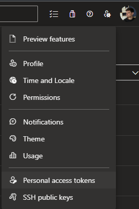
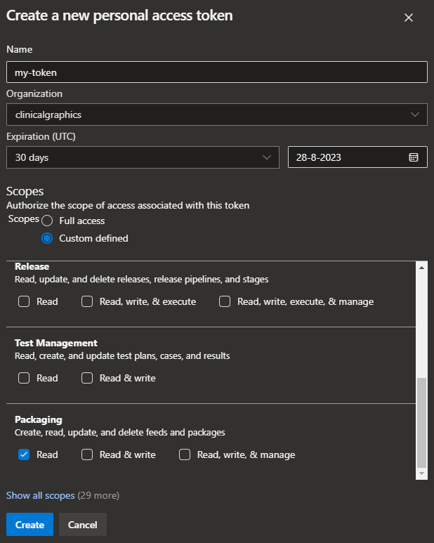

# Azure Artifacts

This is an example configuration for Poetry, npm and docker compose. It should inspire you to see the possibilities keycmd provides thanks to its configuration system.

In this case, we are authenticating with an Azure DevOps Personal Access Token to an Azure Artifacts Feed which serves both Python and Node.js packages — with **one** credential in the keyring, shared by three tools that each want it in a different form.

## Creating the token

Let's begin by creating a Packaging (Read) token in Azure DevOps:



Make sure to check the Packaging (Read) permission, it's the only permission we need for this example.



## Letting Poetry store it

In this case, we won't enter the token into the OS keyring manually. We'll [let Poetry handle it](https://python-poetry.org/docs/repositories/#configuring-credentials). Let's review our `pyproject.toml` file:

```toml
[tool.poetry]
name = "my-project"
version = "1.0.0"
description = ""
authors = ["My Name <my-name@my-organization.com>"]

[[tool.poetry.source]]
name = "main"
url = "https://pkgs.dev.azure.com/my-organization/_packaging/main/pypi/simple/"
priority = "default"

[tool.poetry.dependencies]
python = "~3.9"

[build-system]
requires = ["poetry>=1.0.0"]
build-backend = "poetry.core.masonry.api"
```

Looks like our poetry source is named `main`, so let's run the appropriate command:

```bash
poetry config http-basic.main <username> <personal-access-token>
```

Poetry creates an entry in the OS keyring, and when you run `poetry install` it automatically authenticates using that credential. No need for `keycmd` here!

## Piggybacking with keycmd

Next, we're going to piggyback off this credential with keycmd, to reuse it for npm and for docker compose. That way, we only have one credential to manage — which means one credential to update when it expires.

Look up the new credential in your OS keyring, and store the following configuration in a `.keycmd` file. Of course, **review your OS keyring and adjust your configuration to match the credential name and username!**

```toml
[keys]
PAT = { credential = "credential-name", username = "your-username" }
PAT_B64 = { credential = "credential-name", username = "your-username", b64 = true }
```

We are exposing the same credential twice:

* as the environment variable `PAT`
* again, with base64 encoding applied, as the environment variable `PAT_B64`

This is important, because npm requires that we supply the token with base64 encoding, but other tools do not.

!!! tip "Or use an alias"

    The two entries above look up the same credential twice. An [alias](../guide/configuration.md#aliases) expresses the same thing with a single keyring lookup:

    ```toml
    [keys]
    PAT = { credential = "credential-name", username = "your-username" }

    [aliases]
    PAT_B64 = { key = "PAT", b64 = true }
    ```

## npm

For my npm project, I have an [`.npmrc` file](https://docs.npmjs.com/cli/v7/configuring-npm/npmrc) with the following contents:

```ini
registry=https://pkgs.dev.azure.com/my_organization/_packaging/main/npm/registry/
always-auth=true
//pkgs.dev.azure.com/my_organization/_packaging/main/npm/registry/:username=dev
//pkgs.dev.azure.com/my_organization/_packaging/main/npm/registry/:_password=${PAT_B64}
//pkgs.dev.azure.com/my_organization/_packaging/main/npm/registry/:email=email
//pkgs.dev.azure.com/my_organization/_packaging/main/npm/:username=dev
//pkgs.dev.azure.com/my_organization/_packaging/main/npm/:_password=${PAT_B64}
//pkgs.dev.azure.com/my_organization/_packaging/main/npm/:email=email
```

Now I can set up my `node_modules` just by calling:

```bash
keycmd npm install
```

🚀

!!! note

    npm will complain if you make any calls such as `npm run [...]` without the environment variable set. 🙄 You can set them to the empty string to make npm shut up. I use `export PAT_B64=` (or `setx PAT_B64=` on Windows).

## docker compose

Additionally, I also have a docker compose file in this project which is configured as follows:

```yaml
secrets:
  token:
    environment: PAT
  token_b64:
    environment: PAT_B64
```

When I call `keycmd docker compose build` these two variables are exposed by keycmd and subsequently they are available as [docker compose build secrets](https://docs.docker.com/compose/use-secrets/). 👌
