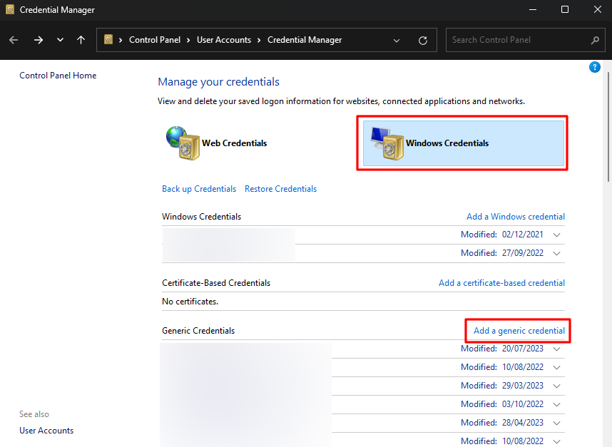
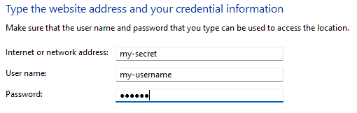
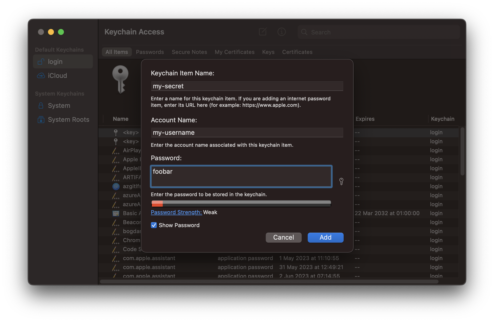
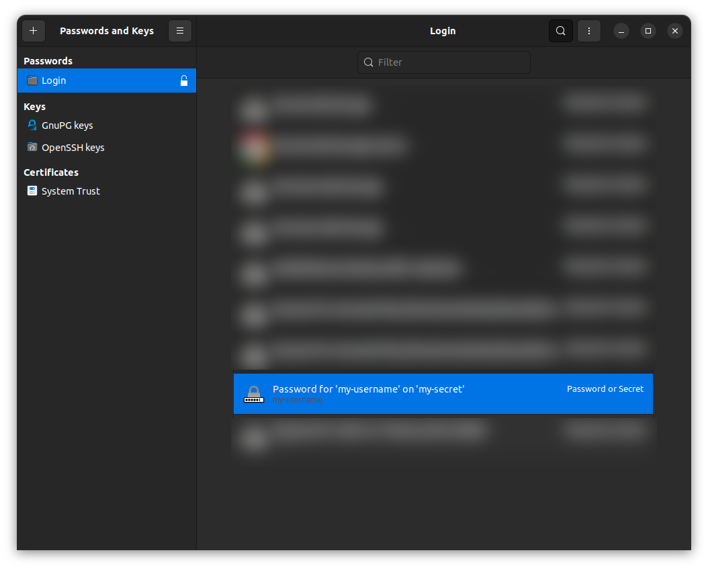

# Quick Start

This tutorial takes a few minutes and covers everything keycmd does: you store a credential in your OS keyring, name it in a configuration file, and run a command that can read it.

For the purpose of this example, use `my-secret` as the credential name and `my-username` as the... username. We'll use `foobar` as the password.

## 1. Store a credential in your keyring

How you add a credential depends on your platform.

=== "Windows"

    Click Start and type "Credential Manager" to find the app. Open the **Windows Credentials** tab, and click **Add a generic credential**.

    

    

=== "macOS"

    Open Keychain Access (++cmd+space++, type `keychain access`), then press ++cmd+n++ to add a new password item. Note that **Account Name** holds the username.

    

=== "Linux"

    The easiest way to add a credential on Linux is through Python's `keyring` package. Adding a password through the GUI does not always let you set a username, which is a problem for keycmd's internal `keyring.get_password()` call:

    ```python
    >>> import keyring
    >>> keyring.set_password("my-secret", "my-username", "foobar")
    ```

    After that it shows up in your credential manager. On Ubuntu that's `seahorse`, which should now show the new password:

    

    This approach generalizes to other distributions — and to other operating systems, for that matter.

## 2. Write a configuration file

Create a `.keycmd` file in your user home folder, with the following contents:

```toml
[keys]
SECRET = { credential = "my-secret", username = "my-username" }
```

This says: look up the credential `my-secret` for user `my-username`, and expose the password it holds as the environment variable `SECRET`.

## 3. Run a command

Open a terminal and run a command that prints the secret. That looks different depending on the shell you use:

=== "bash / zsh"

    ```bash
    keycmd 'echo $SECRET'
    ```

=== "PowerShell"

    ```powershell
    keycmd 'echo $env:SECRET'
    ```

=== "cmd"

    ```bat
    keycmd echo %SECRET%
    ```

You should see the text `foobar` printed to your terminal.

You've successfully set up keycmd! 👏

## What just happened

keycmd read your configuration, looked `my-secret` up in your OS keyring, put the password in the environment as `SECRET`, and handed that environment to your shell along with your command. When the command finished, the variable went with it: your own shell never had it.

Note the quotes in the bash and PowerShell examples. Quoting the whole command as one argument is what lets *your command's shell* expand `$SECRET`, rather than your own shell expanding it before keycmd ever sees it. See [Running commands](../guide/running-commands.md) for the details.

## Where to go next

* [Running commands](../guide/running-commands.md) — the two ways to invoke keycmd, quoting, and subshells.
* [Configuration](../guide/configuration.md) — where configuration lives, and everything you can put in it.
* [Examples](../examples/openai.md) — an OpenAI API key, and a real world setup where poetry, npm and docker compose share a single Azure DevOps token.
* [Troubleshooting](../guide/troubleshooting.md) — if any of the above did not go as planned, `keycmd --verbose` will tell you why.
